# School_District_Analysis

## Purpose

The purpose of this data analysis was to determine relationships between math and reading scores, against school type, school size, and school spending ranges.
After the data was reviewed, there was a suspicion of academic dishonesty from Thomas High School's ninth graders
The school board asked us to remove their scores and redo the school district analysis

## Results

### How is the district summary affected

Original Analysis:
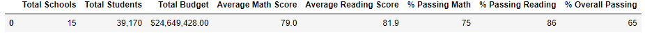

After the 9th graders from Thomas High School scores were replaced as Nan

Adjusted Analysis:
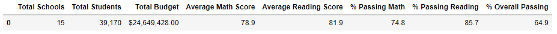

The change was less than a 1% difference. The numbers would be the same if rounded up.

### How is the school summary affected?

Original Analysis:
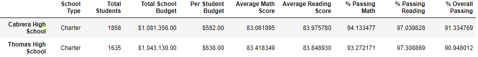

Adjusted Analysis:
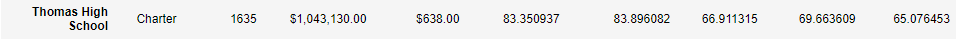

The overall passing percentage dropped from 91% to 65%.

### How does replacing the ninth graders' math and reading scores affect Thomas High School's performance relative to other schools?

Original Analysis:
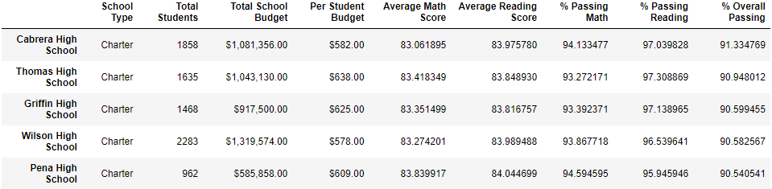

Thomas High School was in the 2nd of the 15 schools prior to removing the ninth graders' scores.

Adjusted Analysis:
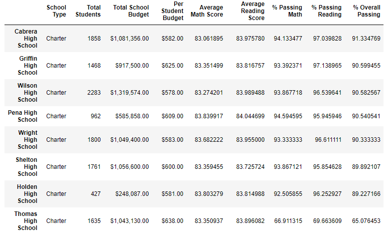

Thomas High School dropped to 8th out of the 15 schools.

## How does replacing the ninth grader's scores affect:

### Adjusted Averages for Math and Reading Scores

Original Math Scores:
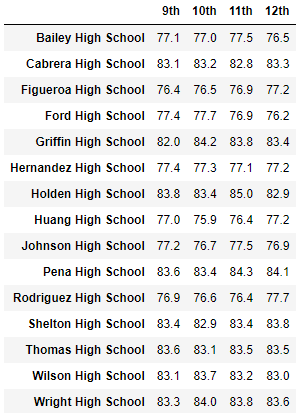

Original Reading Scores
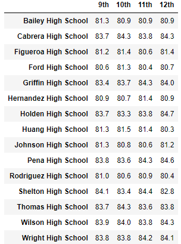

Adjusted Math Scores:
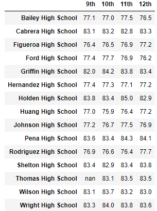

Adjusted Reading Scores:
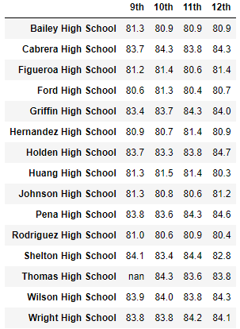

Thomas High School's ninth grade scores now appear as 'nan'.

### Scores by School Spending

Thomas High School is in the $630-$644 spending range.

Original Analysis:
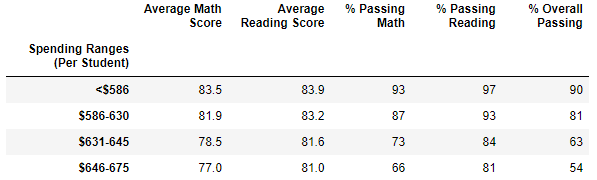

Adjusted Analysis:
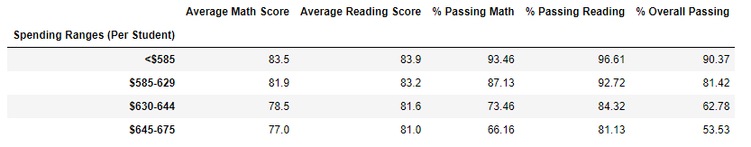

There were negligible impact by spending.

### Scores by School Size

Thomas High School was considered a medium sized school.

Original Analysis:
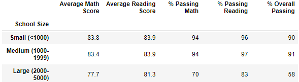

Adjusted Analysis:
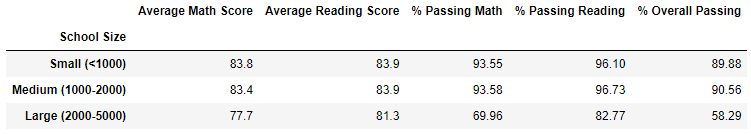

There was negligible impact by school size.

### Scores by School Type

Thomas High School is a charter school type.

Original Analysis:
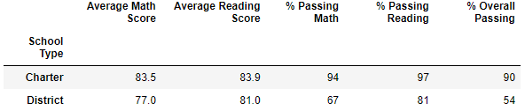

Adjusted Analysis:
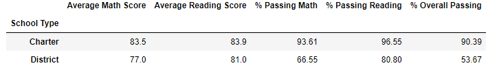

There was negligible impact by school type.

## Summary

- Thomas High School's math and reading percentages dropped.
- Thomas High School's overall passing percentage dropped from 91% to 65%.
- Thomas High School's ranking dropped from 2nd to 8th of the 15 schools.
- The Thomas High School's ninth graders' scores now show up as 'NaN'.

